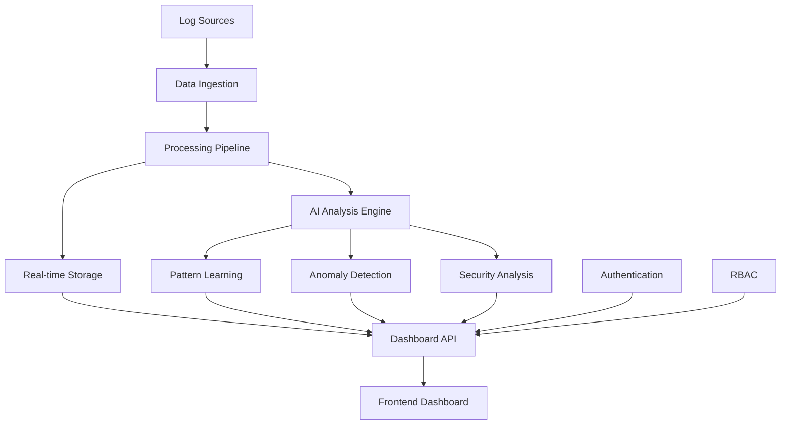

# CyberScope Enterprise Architecture

## System Overview

CyberScope is an enterprise-grade log analytics platform with quantum-enhanced AI capabilities, designed for large-scale deployment in corporate environments. The system combines traditional log processing with advanced AI analysis, security monitoring, and autonomous learning.

## Architecture Components

### 1. Frontend Layer
- **Technology**: React + TypeScript + Tailwind CSS + shadcn/ui
- **Features**:
  - Responsive dashboard with real-time updates
  - Dark/Light mode support
  - Internationalization (i18n) with Arabic support
  - Advanced data visualizations using Recharts
  - Role-based UI components

### 2. API Layer
- **Technology**: FastAPI + Python
- **Components**:
  - RESTful API endpoints
  - WebSocket connections for real-time data
  - JWT-based authentication
  - Role-based access control (RBAC)
  - API documentation via OpenAPI/Swagger

### 3. Authentication & Security
- **Security Manager**: Enterprise-grade security with RBAC
- **Features**:
  - JWT token authentication
  - Multi-factor authentication (MFA) support
  - Account lockout policies
  - Comprehensive audit logging
  - Role-based permissions matrix

### 4. AI/ML Engine
- **Local AI Agent**: No external APIs required
- **Capabilities**:
  - Anomaly detection using Isolation Forest
  - Pattern recognition and learning
  - Security threat analysis
  - Natural language processing (local models)
  - Self-improving algorithms

### 5. Data Processing
- **Log Ingestion**: Multi-source log collection
- **Processing Pipeline**: Real-time stream processing
- **Storage**: Time-series optimized storage
- **Analytics**: Statistical analysis and trend detection

### 6. Monitoring & Observability
- **System Metrics**: Performance monitoring
- **Health Checks**: Service availability monitoring
- **Alerting**: Real-time alert system
- **Audit Trails**: Complete action logging

## Data Flow Architecture



## Security Architecture

### Authentication Flow
1. User submits credentials
2. Security Manager validates password
3. MFA verification (if enabled)
4. JWT token generation
5. Role-based permission assignment
6. Audit log creation

### Authorization Model
- **Roles**: Admin, Security Analyst, System Operator, Viewer, Guest
- **Permissions**: Resource-based access control
- **Audit**: All actions logged with user context

## AI/ML Architecture

### Local AI Agent Components

1. **Anomaly Detection Module**
   - Isolation Forest algorithm
   - Real-time scoring
   - Adaptive thresholds
   - Historical baseline learning

2. **Pattern Recognition Engine**
   - TF-IDF vectorization
   - Clustering algorithms (DBSCAN, K-Means)
   - Temporal pattern analysis
   - Behavioral profiling

3. **Security Analysis Engine**
   - Threat pattern matching
   - Risk scoring algorithms
   - Attack vector identification
   - Automated response recommendations

4. **Learning Loop**
   - Continuous model retraining
   - Pattern database updates
   - Performance metric tracking
   - Model versioning and rollback

### AI Training Pipeline

```python
# Simplified training workflow
def ai_training_loop():
    while system_running:
        # 1. Collect new data
        new_data = collect_log_entries()
        
        # 2. Extract features
        features = extract_features(new_data)
        
        # 3. Update models
        if should_retrain(features):
            retrain_models(features)
            
        # 4. Learn patterns
        update_pattern_database(new_data)
        
        # 5. Generate insights
        insights = generate_insights()
        
        # 6. Save models
        persist_models()
        
        sleep(training_interval)
```

## Microservices Architecture

### Core Services

1. **Authentication Service**
   - User management
   - Token validation
   - MFA handling
   - Audit logging

2. **Data Ingestion Service**
   - Multi-source collection
   - Format normalization
   - Rate limiting
   - Error handling

3. **AI Analysis Service**
   - Real-time processing
   - Model management
   - Insight generation
   - Learning coordination

4. **Dashboard Service**
   - API aggregation
   - Real-time updates
   - Caching layer
   - Response optimization

5. **Monitoring Service**
   - Health checks
   - Metrics collection
   - Alert management
   - Performance tracking

## Database Design

### Primary Storage
- **Time-series Database**: Optimized for log data
- **Schema**: Flexible JSON-based structure
- **Indexing**: Time-based and content-based indexes
- **Retention**: Configurable data retention policies

### AI Model Storage
- **Model Artifacts**: Serialized ML models
- **Pattern Database**: Learned patterns and features
- **Configuration**: Model parameters and settings
- **Versioning**: Model version management

## Deployment Architecture

### Container Strategy
```dockerfile
# Multi-stage build for production
FROM node:18-alpine AS frontend-build
# Build React frontend

FROM python:3.11-slim AS backend-build
# Build Python backend

FROM python:3.11-slim AS production
# Production container with both components
```

### Orchestration
- **Docker Compose**: Development environment
- **Kubernetes**: Production deployment
- **Helm Charts**: Configuration management
- **CI/CD**: Automated deployment pipeline

## Scalability Considerations

### Horizontal Scaling
- **Load Balancing**: Multi-instance deployment
- **Database Sharding**: Time-based partitioning
- **Caching**: Redis for frequently accessed data
- **Queue Systems**: Asynchronous processing

### Vertical Scaling
- **Resource Optimization**: Memory and CPU tuning
- **Model Optimization**: Efficient algorithm selection
- **Database Tuning**: Query optimization
- **Caching Strategies**: Multi-level caching

## Performance Metrics

### System Performance
- **Throughput**: Logs processed per second
- **Latency**: End-to-end processing time
- **Availability**: System uptime percentage
- **Error Rate**: Failed processing percentage

### AI Performance
- **Accuracy**: Prediction accuracy metrics
- **Precision/Recall**: Classification performance
- **Learning Rate**: Pattern learning speed
- **Model Drift**: Performance degradation detection

## Security Considerations

### Data Protection
- **Encryption**: At-rest and in-transit encryption
- **Access Control**: Multi-layer security
- **Data Masking**: Sensitive data protection
- **Backup**: Secure backup strategies

### Network Security
- **TLS**: All communications encrypted
- **Firewall**: Network-level protection
- **VPN**: Secure remote access
- **Monitoring**: Network traffic analysis

## Monitoring & Observability

### Metrics Collection
- **Application Metrics**: Performance counters
- **System Metrics**: Resource utilization
- **Business Metrics**: User activity tracking
- **Security Metrics**: Threat detection rates

### Alerting Strategy
- **Threshold-based**: Static threshold alerts
- **Anomaly-based**: AI-driven alerting
- **Escalation**: Multi-tier alert routing
- **Integration**: External notification systems

## Disaster Recovery

### Backup Strategy
- **Data Backup**: Regular automated backups
- **Model Backup**: AI model versioning
- **Configuration Backup**: System settings backup
- **Point-in-time Recovery**: Granular recovery options

### High Availability
- **Redundancy**: Multi-zone deployment
- **Failover**: Automatic failover mechanisms
- **Load Distribution**: Traffic distribution
- **Health Monitoring**: Continuous health checks

## Future Enhancements

### Planned Features
- **Federated Learning**: Distributed AI training
- **Advanced NLP**: Enhanced text analysis
- **Graph Analytics**: Relationship analysis
- **Predictive Maintenance**: Proactive system care

### Scalability Roadmap
- **Cloud Native**: Kubernetes-native deployment
- **Multi-tenancy**: Enterprise multi-tenant support
- **Edge Computing**: Distributed processing
- **Real-time Streaming**: Advanced stream processing

## Development Guidelines

### Code Standards
- **Python**: PEP 8 compliance
- **TypeScript**: Strict type checking
- **Testing**: Comprehensive test coverage
- **Documentation**: Inline code documentation

### Deployment Standards
- **Infrastructure as Code**: Terraform/Ansible
- **GitOps**: Git-based deployment
- **Environment Parity**: Consistent environments
- **Security Scanning**: Automated security checks

## Conclusion

CyberScope Enterprise represents a comprehensive, scalable, and secure log analytics platform designed for enterprise deployment. The architecture supports both current requirements and future growth, with emphasis on security, performance, and autonomous AI capabilities.